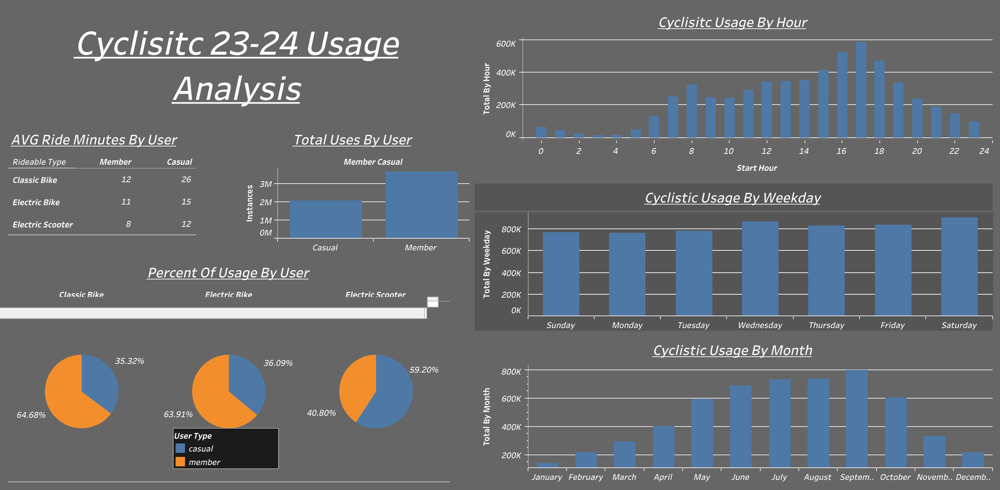

# **Project Title: Cyclistic Data Analysis Case Study**

## **Table of Contents**
1. [Project Status](#project-status)
2. [Project Overview and Background](#project-overview-and-background)
3. [Dataset Information](#dataset-information)
4. [Objectives](#objectives)
5. [Technologies Used](#technologies-used)
6. [Insights and Results](#insights-and-results)
7. [Considerations](#considerations)

---
## **Project Status**
- Currently Working on SQL Scripts to extract the data I want for visualizations.

## **Project Overview and Background**
**Overview**

This project focuses on analyzing historical data from a fictional bike-sharing company to uncover key insights and trends. The primary objective is to explore patterns in user behavior, identify factors affecting member retention, and develop strategies to convert casual users into long-term subscribers. Through data cleaning, analysis, and visualization, actionable recommendations are made to enhance the company’s overall performance and customer engagement.

**Background**

A bike-share program that features more than 5,800 bicycles and 600 docking stations. Cyclistic sets itself apart by also offering reclining bikes, hand tricycles, and cargo bikes, making bike-share more inclusive to people with disabilities and riders who can’t use a standard two-wheeled bike. The majority of riders opt for traditional bikes; about 8% of riders use the assistive options. Cyclistic users are more likely to ride for leisure, but about 30% use them to commute to work each day.

Until now, Cyclistic’s marketing strategy relied on building general awareness and appealing to broad consumer segments. One approach that helped make these things possible was the flexibility of its pricing plans: single-ride passes, full-day passes, and annual memberships. Customers who purchase single-ride or full-day passes are referred to as casual riders. Customers who purchase annual memberships are Cyclistic members.

Cyclistic’s finance analysts have concluded that annual members are much more profitable than casual riders. Although the pricing flexibility helps Cyclistic attract more customers, Moreno (the director of marketing and my manager) believes that maximizing the number of annual members will be key to future growth. Rather than creating a marketing campaign that targets all-new customers, Moreno believes there is a very good chance to convert casual riders into members. She notes that casual riders are already aware of the Cyclistic program and have chosen Cyclistic for their mobility needs.

Moreno has set a clear goal: Design marketing strategies aimed at converting casual riders into annual members. In order to do that, however, the marketing analyst team needs to better understand how annual members and casual riders differ, why casual riders would buy a membership, and how digital media could affect their marketing tactics. Moreno and her team are interested in analyzing the Cyclistic historical bike trip data to identify trends. 

**Scenario**

I am assuming the role of a junior data analyst working in the marketing analyst team at Cyclistic, a bike-share company in Chicago. The director of marketing believes the company’s future success depends on maximizing the number of annual memberships. Therefore, my team wants to understand how casual riders and annual members use Cyclistic bikes differently. From these insights, my team will design a new marketing strategy to convert casual riders into annual members. But first, Cyclistic executives must approve our recommendations, so they must be backed up with compelling data insights and professional data visualizations.

---

## **Dataset Information**
- **Source:** [Cyclistic Trip Data](https://divvy-tripdata.s3.amazonaws.com/index.html)
- **Export Size:** [1.09 GB]
- **Description:**
I will use the Divvy trip data 12/2023 - 11/2024 for this analysis project, combine the 12 CSV's using a python script analyze this data. The name of the combined CSV's is last_12Months.csv. Below is a map of the table that was exported pre data cleaning. The data has been made available by Motivate International Inc. under this [license](https://divvybikes.com/data-license-agreement).

This public dataset provides insight into how different customer types use Cyclistic bikes. However, due to data privacy regulations, riders’ personally identifiable information is excluded. As a result, connecting past purchases to credit card details or determining whether casual riders live within the Cyclistic service area or have made multiple single purchases is not possible.

    1.  ride_id (String/Integer): Unique identifier for each trip.
    2.  rideable_type(Text): The type of rental used for the trip.
    3.  start_station_name(Text): The station the equipment was rented from.
    4.  start_station_id(Text): Unique Identifier for the rental station.
    5.  end_station_name(Text): The station the equipment was returned to.
    6.  end_station_id(Text): Unique Identifier for the drop off station. 
    7.  start_lat(Double Precision): Rental location latitiude. 
    8.  start_lng(Double Precision): Rental location longitude. 
    9.  end_lat(Double Precision): Drop off location latitidue.
    10. end_lng(Double Precision): Drop off location longitude. 
    11. member_casual(Text): Type of user that rented the equipment. 
    12. started_at(Text): Date and time the equipment was rented.
    13. ended_at(Text): Date and time the equipment was dropped off. 

---

## **Objectives**
The main objective of this project is to:
Devise marketing strategies to convert casual riders to members.

Analysis Questions
Three questions will guide the future marketing program:

How do annual members and casual riders use Cyclistic bikes differently?
Why would casual riders buy Cyclistic annual memberships?
How can Cyclistic use digital media to influence casual riders to become members?

Moreno has assigned me the first question to answer: How do annual members and casual riders use Cyclistic bikes differently?

---

## **Technologies Used**
- **Database Management System:** PostgreSQL / Excel
- **Languages:** SQL / Python
- **Visualization Tools:** Tableau /  Excel 
- **IDE/Editor:** VSCode / pgAdmin

---

## **Insights and Results**
- 
- Members used Cyclistic for shorter rides on average but took nearly twice as many rides as casual users, indicating higher overall engagement. Among the three services offered—Classic Bikes, Electric Bikes, and Electric Scooters—Electric Bikes were the most popular. Members primarily used Classic and Electric Bikes, while casual users favored Electric Scooters, which had a smaller sample size.
- Date analysis revealed Cyclistic usage patterns by hour, weekday, and month. The peak usage hour was 17:00, with over 500,000 rides. Usage was evenly distributed across weekdays, with slightly higher activity on Saturdays. Summer months saw the highest usage, consistent with the fictional Chicago location, where cold winters likely reduce outdoor activity.

- 
- The geographic data confirms insights from the previous visualization, showing that members covered 64.16% of the total kilometers traveled, using Cyclistic services more frequently and for greater distances. While average distances per service type were similar, casual users traveled farther on Classic Bikes than members, highlighting differing usage patterns. 
- The density mapping of members revealed a higher concentration of activity around central Chicago, particularly near the business district. In contrast, the density mapping for casual users showed a broader dispersion, with coastal areas emerging as hotspots for usage.

### Results and Recommendations

- **Promote Membership in High-Use Areas**  
  Leveraging density mapping insights, targeted marketing campaigns can be deployed in areas with high casual user activity, such as coastal zones and recreational areas. Digital and physical promotions at popular docking stations can include membership incentives, highlighting the convenience and cost savings for frequent riders. Additionally, focusing campaigns in business districts emphasizes Cyclistic’s utility for commuting, which appeals to member behaviors.

- **Enhance Electric Scooter Options**  
  Since Electric Scooters were frequently used by casual riders, introducing scooter-specific memberships can attract this group. Plans tailored to short-distance or leisure riders, combined with expanded scooter availability in casual-heavy areas, could drive conversions. This strategy ensures casual users see value in subscribing while maintaining their preferred mode of transport.

- **Gamify Membership Engagement**  
  Implementing features like mileage challenges and exclusive events for members can drive casual-to-member conversions. For instance, casual riders could be incentivized with free ride credits for meeting usage milestones, encouraging them to try membership. Hosting community-focused events such as bike tours or workshops adds value to being a member.

- **Educate on Membership Benefits at Docking Stations**  
  Physical touchpoints like interactive displays at docking stations can educate casual users on the financial and practical benefits of membership. For example, showing real-time cost savings based on their current usage can highlight the value of converting. Having Cyclistic representatives on-site to assist with questions and promotions can further enhance conversion efforts.

---

## **Considerations** 

- [Cyclistic Trip Data](https://divvy-tripdata.s3.amazonaws.com/index.html)
- [license](https://divvybikes.com/data-license-agreement)

 
